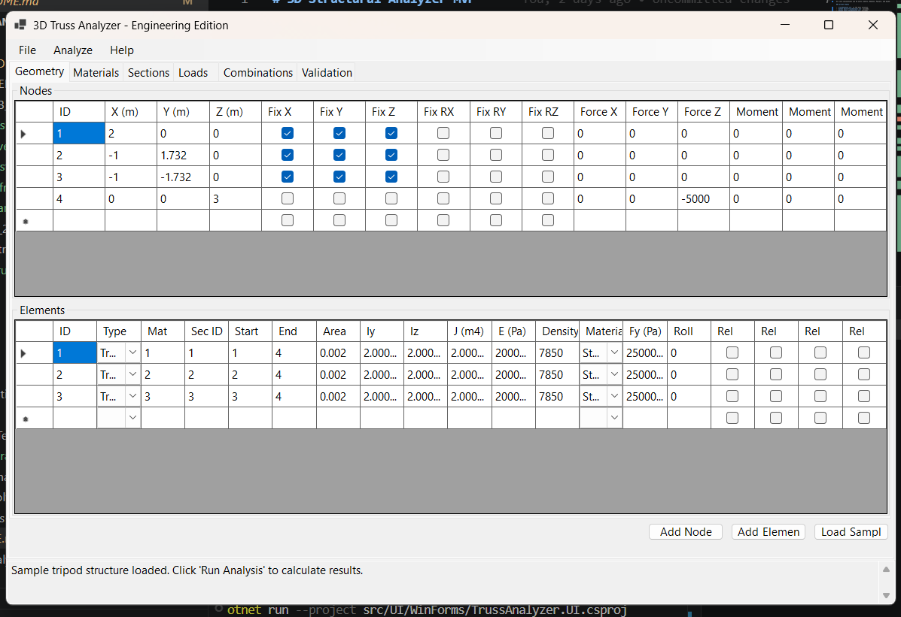
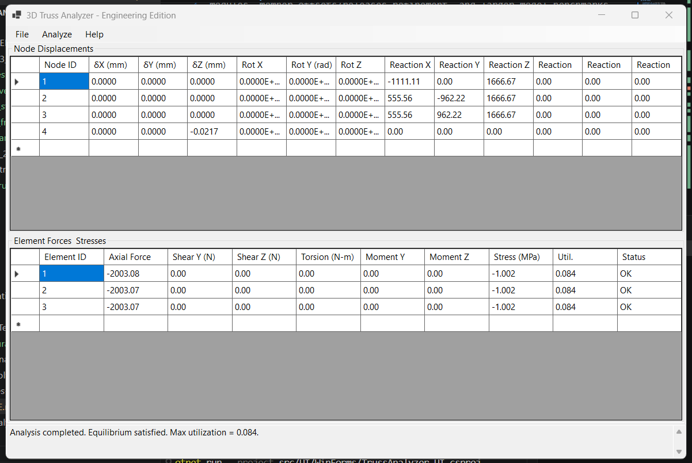
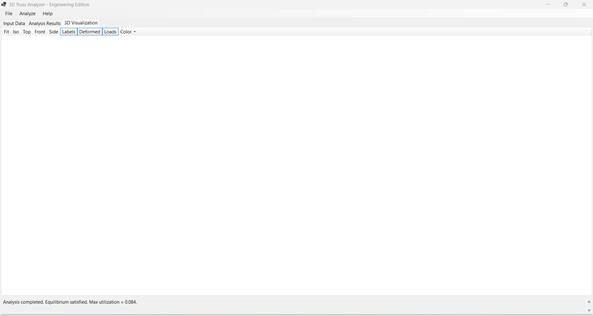

# 3D Structural Analyzer MVP

This project is a C#/.NET 8 structural analysis MVP for linear elastic 3D truss and 3D frame/beam-column models. It keeps the original `TrussSolver` API as a compatibility facade and adds a newer `StructuralModel` + `StructuralSolver` pipeline for 6-DOF frame analysis.

All core calculations use SI units: meters, Newtons, Pascals, and kg/m3.

## Current Status

- `TrussAnalyzer.sln` is the main solution.
- `dotnet build TrussAnalyzer.sln` succeeds.
- `dotnet test TrussAnalyzer.sln` succeeds.
- Existing truss workflows and tests remain supported.
- New MVP structural workflow supports:
  - `TrussElement`: axial-only 3D truss behavior.
  - `FrameElement3D`: 6 DOF per node with axial, torsion, bending, shear/end-force recovery.
  - `StructuralModel` container for nodes, elements, materials, sections, load cases, load combinations, and load items.
  - Nodal force/moment loads, member point loads, member distributed loads, and self-weight.
  - Schema v2 JSON import/export while still importing legacy truss JSON.
  - Preliminary steel/aluminum/custom stress checks and simplified RC axial/flexure/shear checks.
  - Frame member moment releases, local roll angle, local-axis helpers, and richer member load recovery.
  - WinForms engineering desktop shell with ribbon-style actions, object tree, properties panel, bottom input/results grids, and a WPF/HelixToolkit 3D viewer.
  - Viewer coordinate convention is right-handed Z-up: X/Y are plan axes, Z is vertical, and gravity/self-weight acts in -Z.
  - Viewer displays global axes (X red, Y green, Z blue), XY grid, view cube, member tubes, supports, load arrows, local member axes, deformed shape, and force/moment/utilization modes.
  - Solver diagnostics and a replaceable linear solver interface with dense solver as the default.

Design checks are preliminary MVP checks only. They are AISC/ACI-inspired sanity checks, not final code-compliant design.

## Project Structure

```text
3DTruss_Analyzer_Refactored/
  src/
    Core/
      Models/            # Node, Element, StructuralModel, Material, Section, Loads, Results
      IO/                # JSON/CSV import and export
      Reporting/         # Basic PDF report generation
      Utilities/         # Dense matrix solver
      TrussSolver.cs     # Legacy truss compatibility solver
      StructuralSolver.cs
    UI/WinForms/         # Desktop UI and OpenGL viewer
  tests/                 # Unit and integration tests
  docs/                  # Engineering and development notes
  examples/              # Example JSON models
  TrussAnalyzer.sln
```

## Build And Test

Prerequisites:

- .NET 8 SDK or later
- Windows desktop runtime support for WinForms/WPF

```bash
dotnet build TrussAnalyzer.sln
dotnet test TrussAnalyzer.sln
dotnet run --project src/UI/WinForms/TrussAnalyzer.UI.csproj
```

## Coordinate And Sign Convention

- Global coordinate system: right-handed, Z-up.
- Global X and Y are the plan axes; global Z is vertical.
- Gravity and self-weight act in global `-Z`.
- Forces `FX/FY/FZ` and moments `MX/MY/MZ` in the UI are global components unless a member load direction is explicitly set to local.
- Member local `x` runs from start node `i` to end node `j`; local `y/z` are generated as a right-handed basis and can be rotated with roll angle.
- Positive truss axial force is tension; negative axial force is compression.
- Truss elements recover axial force only. Shear, torsion, and bending diagrams require `FrameElement3D`.

## Minimal Structural Example

```csharp
using TrussAnalyzer.Core;
using TrussAnalyzer.Core.Models;

var model = new StructuralModel();
model.Materials.Add(Material.StructuralSteel with { Id = 1 });
model.Sections.Add(Section.Generic(1, "Frame section", 0.003, 6e-6, 8e-6, 2e-6));

model.Nodes.Add(new Node(1, new Point3D(0, 0, 0))
{
    ConstraintX = true,
    ConstraintY = true,
    ConstraintZ = true,
    ConstraintRX = true,
    ConstraintRY = true,
    ConstraintRZ = true
});

var tip = new Node(2, new Point3D(3, 0, 0));
tip.ApplyForce(0, -10_000, 0);
model.Nodes.Add(tip);

model.Elements.Add(new FrameElement3D(1, 1, 2, materialId: 1, sectionId: 1));

var result = new StructuralSolver(model).Analyze();
Console.WriteLine(result.NodeResults.Single(n => n.NodeId == 2).Displacement.Y);
```

## Known Limitations

- Linear elastic, small-displacement analysis only.
- No shell, slab, wall, plate, solid, cable, spring, or nonlinear concrete cracking elements.
- No P-Delta, plastic hinge, modal, dynamic, seismic response spectrum, or automatic wind/seismic load generation.
- Frame formulation is an MVP Euler-Bernoulli beam-column implementation without offsets or shear deformation.
- Sparse solver integration exists as an interface/placeholder; production sparse storage/solve is still future work.
- Design checks are preliminary and do not replace licensed engineering judgement or final code checks.
- `Matrix.SolveAuto()` currently uses dense Gaussian elimination; the sparse interface is ready but not a true sparse implementation yet.
- The built-in PDF writer is a basic report generator, not a full PDF layout engine.

## Roadmap

- Phase 1: stable build/test baseline and legacy truss compatibility - complete.
- Phase 2: 6-DOF frame solver, material/section/load systems, schema v2 IO - MVP complete.
- Phase 3: preliminary steel/RC design checks and structural UI workflow - MVP complete.
- Phase 4: richer viewer controls, labels, load glyphs, member releases, local axis roll, UI editor tabs, and solver interface - complete.
- Phase 5: preliminary design settings, report/export improvements, solver diagnostics, example models, and WPF/Helix viewer shell - partial MVP complete.
- Next: true sparse matrix implementation, code-calibrated AISC/ACI modules, member offsets/releases refinement, larger-model benchmarks, and deeper viewer picking/editing.
